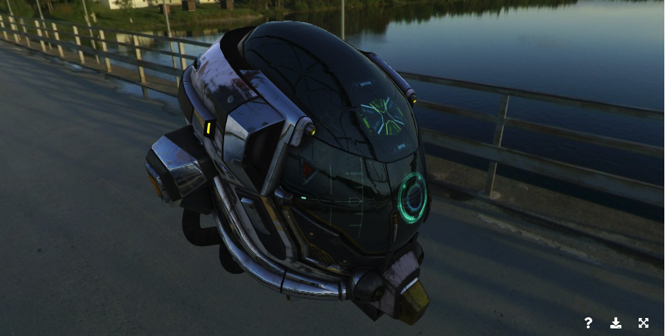

# [WIP] vue-3dmodel-viewer

Vue.JS 3D Model Viewer component, based on THREE.js, inspired by [model-tag](https://github.com/mrdoob/model-tag) and [Sketchfab](https://sketchfab.com/models?features=downloadable&sort_by=-likeCount&type=models)

  

